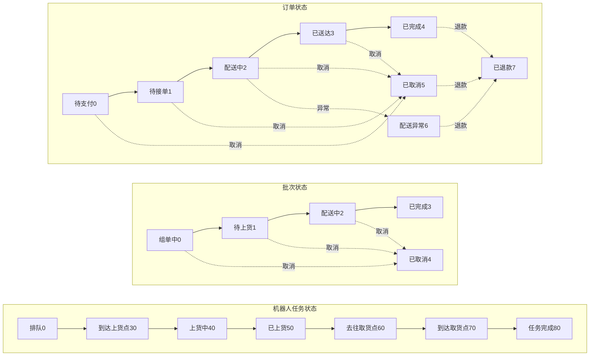
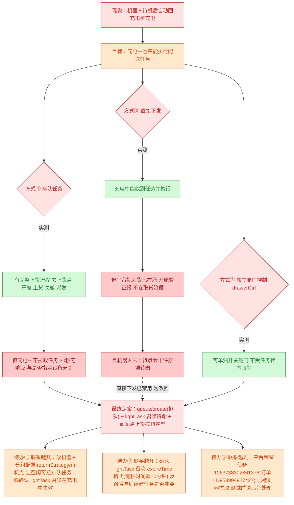

# 校内快递配送机器人 · 流程与算法（Mermaid 纯文本版）

> 之前 Excalidraw 大图保留在上级目录 `无人车逻辑结构树`。
> 本目录改用 **Mermaid 纯文本**：改一行文字即可更新，不需要维护坐标；
> Obsidian / GitHub / VSCode / mermaid.live 都能直接渲染。
>
> 颜色约定：蓝 = 用户端，橙 = 商家端·后端，绿 = 机器人，红 = 决策点 / 异常返回。

## 一、主流程（下单 → 组单 → 召唤待命 → 上货定型 → 真实配送 → 扫码取餐）

> 派车机制（2026-09-07 定案）：批次组单中**持续收单**；后端扫描（15s）**召唤**机器人到上货点待命（lightTask，不创建任务、不锁批次）；商家点批次「**上货(N件)**」才**定型**创建配送任务（queue/create）；**配送路线在关舱后「开始配送」时才规划**（2026-09-08 确认）。实测结论与待办见 图三 / 图四。

```mermaid
flowchart TB
    subgraph PH0["阶段A 用户下单"]
        U1["① 用户下单，选择点位和收餐人"]:::user --> D0{"下单总件数超过12件？"}:::dec
        D0 -->|否| U2["② 用户支付（模拟，直接标记已支付）"]:::user
        D0 -->|是| A0["后端自动拆单，每单最多12件，各自独立订单号与取餐码"]:::mer
        A0 --> U2
        U2 -->|支付成功| P0["订单变为待接单，商家收到新订单提示"]:::mer
    end
    subgraph PH1["阶段B 并入批次（组单）"]
        P0 --> D1{"店铺营业且自动接单已开启？"}:::dec
        D1 -->|是| M2["后端自动接单并并入批次"]:::mer
        D1 -->|否| M3["商家手动接单后并入批次"]:::mer
        M2 --> A1a["后端计算本单商品件数 n（SUM quantity）"]:::mer
        M3 --> A1a
        A1a --> D1b{"存在组单中批次 且 实时已装件数＋n ≤ 12？"}:::dec
        D1b -->|是| A1b["并入已装最多的组单中批次（同多取最新）"]:::mer
        D1b -->|否| A1c["新建批次，生成 BD＋随机码 编号，当日序号＋1"]:::mer
        A1b --> M4["批次成立，状态0 组单中（持续收单）"]:::mer
        A1c --> M4
    end
    subgraph PH2["阶段C 召唤待命（后端自动）"]
        M4 --> C1["后端每15秒定时扫描（店铺营业时），检查各「组单中」批次"]:::mer
        C1 --> D1e{"该批次还有待配送订单？"}:::dec
        D1e -->|否| C1b["跳过（订单已全部取消/退款），等下一轮扫描"]:::mer
        C1b -.->|15秒后| C1
        D1e -->|是| C2["调用 lightTask 召唤机器人到上货点待命"]:::mer
        C2 --> C2a["优先选空闲/待机/充电/返程中的车，否则选任一在线车"]:::mer
        C2a --> C2b["召唤用 lightTask 轻任务，机器人仅先去上货点等待，不创建配送任务、不锁定批次"]:::mer
        C2b --> C2c["召唤失败（如无在线车）则静默跳过，批次继续组单中"]:::mer
    end
    subgraph PH3["阶段D 商家定型（上货按钮）"]
        C2c --> C3["商家端「配单上货」红点显示待配单订单数"]:::mer
        C3 --> M7["商家点批次「上货(N件)」按钮，批次此刻定型"]:::mer
        M7 --> P1["后端确认机器人，未指定则自动选空闲车"]:::mer
        P1 --> D1c{"机器人空闲校验通过？"}:::dec
        D1c -->|否| E2b["机器人忙，请换车"]:::err
        E2b -.->|换车重试| P1
        D1c -->|是| P2{"CAS 抢占成功？把批次从组单中(0)原子改为待上货(1)"}:::dec
        P2 -->|否| E2c["该批次已派车，不能重复派车"]:::err
        E2c -.->|重新派车| P1
        P2 -->|是| P3["后端取出批次内待配送订单（状态1/2），空则退回组单中并中止定型"]:::mer
        P3 --> P4["为每单创建平台任务（queue/create 排队），暂不规划路线顺序"]:::mer
        P4 --> P5["批次定型，状态变1 待上货（锁死，不再收单）"]:::mer
    end
    subgraph PH4["阶段E 上货 · 配送 · 取餐"]
        P5 -->|排队任务拉取| R1["机器人被调度前往上货点"]:::bot
        P5 --> D6{"商家如何进入上货详情页？"}:::dec
        D6 -->|"点批次「上货」按钮"| M7b["不扫码：直接进入已定型批次的上货详情页"]:::mer
        D6 -->|"扫无人车二维码"| M8["扫码识别LD-R，定位该车的待上货批次"]:::mer
        M8 --> D3{"该车有待上货批次？"}:::dec
        D3 -->|否| E1["该车暂无待上货批次，请先接单定型"]:::err
        D3 -->|是| M9["获取该车控制权并返回就位信息"]:::mer
        M7b --> M9b["进入上货详情页，展示机器人就位状态与距上货点距离"]:::mer
        M9 --> M9b
        R1 --> R2["机器人到达上货点（任务30）"]:::bot
        M9b --> M7c["商家点「打开舱门」按钮"]:::mer
        M7c --> D4{"机器人已到上货点≤5米？"}:::dec
        D4 -->|否| E2["拒绝开舱，等待到位（400）"]:::err
        D4 -->|是| M11["③ 开舱上货（逐任务 loading/verify 验证）"]:::mer
        R2 --> R3["机器人上货中（任务40）"]:::bot
        M11 -->|开舱| R3
        M11 --> M12["④ 关舱锁抽屉"]:::mer
        M12 -->|关舱| R4["机器人已上货（任务50）"]:::bot
        M12 --> D5{"⑤ 立即配送？"}:::dec
        D5 -->|是| A2a["规划配送路线：按收餐点位分组订单"]:::mer
        D5 -->|否| M13b["显示圆形「开始配送」按钮，商家点按"]:::mer
        M13b --> A2a
        D5 -.->|"舱门开着禁止移动"| N1["关舱成功后才允许开始配送（安全逻辑，勿删）"]:::err
        A2a --> D1d{"收餐点位都有坐标（pos_x/pos_y）？"}:::dec
        D1d -->|是| A2b["从上货点出发，每次去最近且未访问的点位（贪心最近邻）"]:::mer
        D1d -->|否| A2c["按点位 sort 序号生成路线"]:::mer
        A2b --> A2d["停靠顺序写入 batch.route"]:::mer
        A2c --> A2d
        A2d --> M14["开始配送：逐任务 loading/confirm，批次状态变2 配送中"]:::mer
        M14 --> R5["机器人去往取货点（任务60）"]:::bot
        R5 --> R6["机器人按路线逐点配送，到达取货点（任务70）"]:::bot
        R6 -->|⑥ 已送达| U4["用户看到机器人已送达，扫码取餐"]:::user
        U4 --> U5["⑦ 用户扫LD-R车身码与取餐码"]:::user
        U5 --> U6["⑧ 开舱取餐 40秒"]:::user
        U6 -->|取餐开舱| R7["机器人取餐完成（任务80）"]:::bot
        U6 --> U7["⑨ 关舱，订单完成"]:::user
    end
    subgraph EX1["异常① 取消与退款（任意阶段可入口）"]
        direction TB
        x1["用户或商家取消（免费窗口直取消 / 超时提交申请 / 售后退款申请）"]:::mer
        x1 --> x2["本地落账：退款·库存回补（orderCancel 幂等）"]:::mer
        x2 --> x3["作废任务 + 平台召回机器人"]:::mer
        x3 -->|召回成功| x4["订单取消/退款，从批次摘除"]:::mer
        x3 -->|召回失败| x5["标记待人工处理"]:::err
    end
    subgraph EX2["异常② 配送异常（机器人超时未接单/挂起/失败）"]
        direction TB
        y1["机器人超时未接单或任务挂起（>15分钟）"]:::err
        y1 --> y2{"商家二选一"}:::dec
        y2 -->|重新配送| y3["作废旧任务→从批次摘除→并入新批次→重新上货配送"]:::mer
        y2 -->|取消并退款| y4["作废任务→摘除批次→回补库存→退款"]:::mer
    end
    subgraph EX3["异常③ 取餐超时（两段式）"]
        direction TB
        z1["已送达 15 分钟未取（未打开舱门）"]:::err
        z1 --> z2["一段超时：标记·重排路线先送其他单"]:::mer
        z2 --> z3{"批次其他单送完/取完？"}:::dec
        z3 -->|否| z5["继续等待"]:::mer
        z3 -->|是| z4["重建任务·机器人返回再等 15 分钟（二段）"]:::mer
        z4 --> z6{"二段仍没取？"}:::dec
        z6 -->|是| z7["驳回：取消并退款·作废任务·摘除批次"]:::err
        z6 -->|否| z8["用户取走 → 已完成"]:::mer
        z1 -.->|"打开舱门即「正在取餐」计时暂停"| z9["计时暂停不误判"]:::mer
    end
    P0 -.->|"可取消：免费窗口/取消申请/售后"| x1
    U7 -.->|"已完成可申请售后退款"| x1
    R6 -.->|"机器人超时/挂起/失败"| y1
    y3 -.->|"并入新批次，回到扫描召唤"| C1
    U4 -.->|"已送达未取（15分钟）"| z1
    z8 -.->|"取走"| U7
    classDef user fill:#e7f5ff,stroke:#1971c2,color:#1864ab;
    classDef mer fill:#ffe8cc,stroke:#d9480f,color:#d9480f;
    classDef bot fill:#d3f9d8,stroke:#2f9e44,color:#2b8a3e;
    classDef dec fill:#ffe3e3,stroke:#c92a2a,color:#c92a2a;
    classDef err fill:#ffc9c9,stroke:#c92a2a,color:#a61e1e;
```



## 二、状态机（任务 · 批次 · 订单）



## 三、真机派车机制实测与定案（2026-09-07）

> 图一是目标流程。本节记录真机联调时平台的真实行为，
> 以及据此确定的**最终定案**（接替者勿违背）。颜色约定同图一。



## 四、真机测试记录与定案（2026-09-07）

| 时间     | 步骤                                   | 结果                    | 说明                                                                                                            |
| -------- | -------------------------------------- | ----------------------- | --------------------------------------------------------------------------------------------------------------- |
| 16:49    | 首次派车（排队任务 指定设备）          | ❌ 机器人不动           | 平台任务排队中，机器人充电中不拉取                                                                              |
| 16:55    | 重派（排队任务）                       | ❌ 机器人不动           | 车空闲(lightTask)也不拉取，排队机制不可用                                                                       |
| 17:01    | 直接下发 syncLoading=1                 | ⚠️ 空车去取货           | 跳过上货，误发后强制关闭任务                                                                                    |
| 17:05    | 直接下发 syncLoading=0                 | ✅ 机器人到上货点       | 任务30到达上货点，但开舱验证被拒                                                                                |
| 17:19    | 开舱验证 loading/verify                | ❌ 不在取货阶段         | 平台视为货已在舱（直接下发语义）                                                                                |
| 17:33    | 关任务清货仓                           | ✅ 货仓释放             | 工作人员指示删除任务后恢复                                                                                      |
| 17:47    | 直接下发加独立开舱 drawerCtrl          | ⚠️ 开舱成功但机器人转圈 | 开舱指令可用，但直接下发任务导航异常                                                                            |
| 09-07 晚 | 多单兼容重构落地（召唤待命＋上货定型） | ✅ 代码＋回归全绿       | 派车机制定案：queue/create 排队＋lightTask 召唤待命＋商家上货定型；create/direct 已禁用；真实环境首次联调为待办 |

**平台行为结论**

1. 排队任务（queue/create）有完整上货流程，但机器人处于充电状态时不会拉取；
   机器人配置为待机自动回充电桩，导致排队任务永远等不到车。
2. 直接下发（create/direct）任务充电中能执行，但语义是货已在舱，无法走上货开舱流程，
   且机器人去上货点会出现导航转圈异常 —— **已禁用，勿改回**。
3. 独立舱门控制接口（drawerCtrl）可用，不受任务状态限制。
4. **最终定案：派车走 queue/create（排队）＋ lightTask 召唤待命 ＋ 商家点上货按钮定型。**

**待办（需联系越凡工作人员）**

1. **（最高优先）** 机器人待机自动回充电桩 → 充电中不拉排队任务：改机器人分组配置
   （returnStrategy/待机点）让空闲能拉取；或确认 **lightTask 召唤在充电中是否生效**。
2. 确认 lightTask 召唤 `expireTime` 格式（当前毫秒时间戳字符串，10 分钟），
   及召唤与后续任务创建是否冲突。
3. 平台残留任务 `1263738302861376`（订单 LD953994927427）此前"已被机器人拉取"无法程序关闭，
   **测试前请平台后台处理**（防真车被误调度）。

## 怎么用

- **浏览器看**：双击同目录的 `流程与算法.html`（在线加载渲染引擎，需联网）
- **在线编辑**：把任意一个 ```mermaid 代码块粘贴到 [mermaid.live](https://mermaid.live)
- **Obsidian / GitHub / VSCode**：直接打开本文件，代码块自动渲染
- **让 AI 改**：直接说"把 XX 改成 YY"，改的是纯文本，一行搞定
