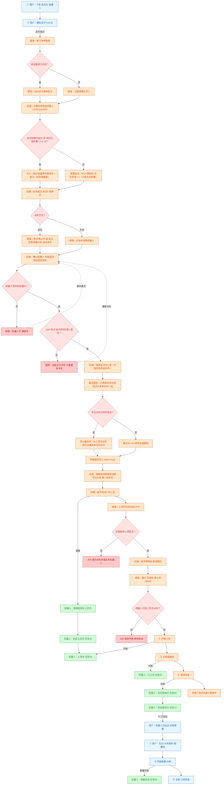
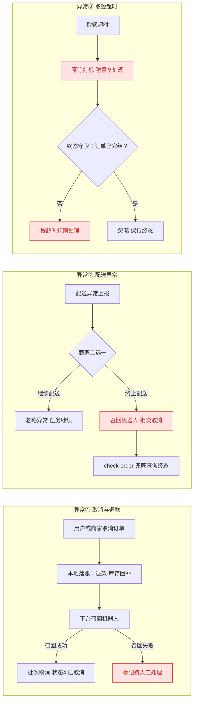
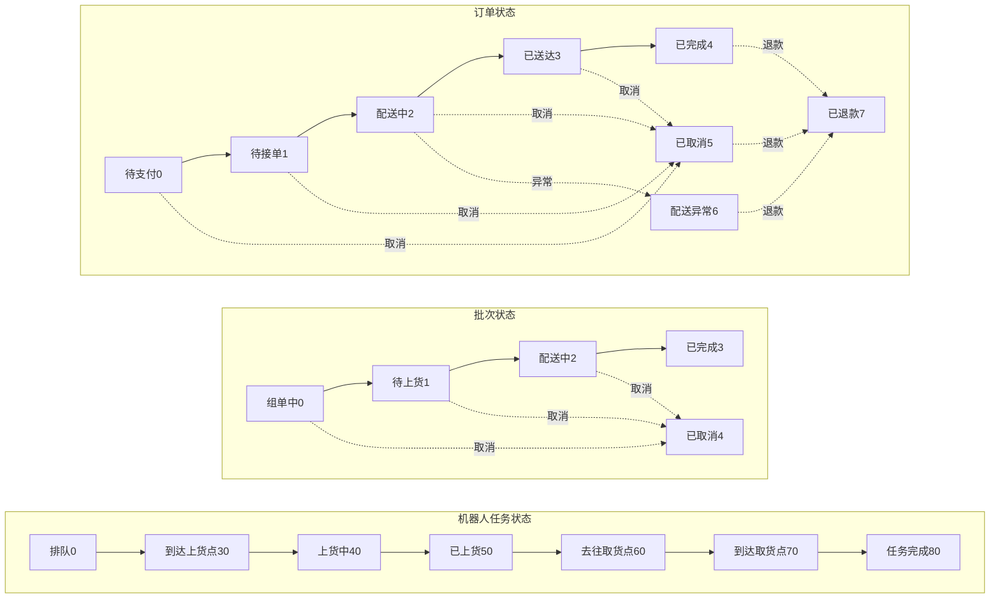

# 送餐无人车 · 流程与算法（Mermaid 纯文本版）

> 之前 Excalidraw 大图保留在上级目录 `无人车逻辑结构树`。
> 本目录改用 **Mermaid 纯文本**：改一行文字即可更新，不需要维护坐标；
> Obsidian / GitHub / VSCode / mermaid.live 都能直接渲染。
>
> 颜色约定：蓝 = 用户端，橙 = 商家端·后端，绿 = 机器人，红 = 决策点 / 异常返回。

## 一、主流程（下单 → 组单 → 派车 → 上货 → 真实配送 → 扫码取餐）



## 二、异常与兜底（取消退款 / 配送异常 / 取餐超时）



## 三、状态机（任务 · 批次 · 订单）



## 怎么用

- **浏览器看**：双击同目录的 `流程与算法.html`（在线加载渲染引擎，需联网）
- **在线编辑**：把任意一个 ```mermaid 代码块粘贴到 [mermaid.live](https://mermaid.live)
- **Obsidian / GitHub / VSCode**：直接打开本文件，代码块自动渲染
- **让 AI 改**：直接说"把 XX 改成 YY"，改的是纯文本，一行搞定
